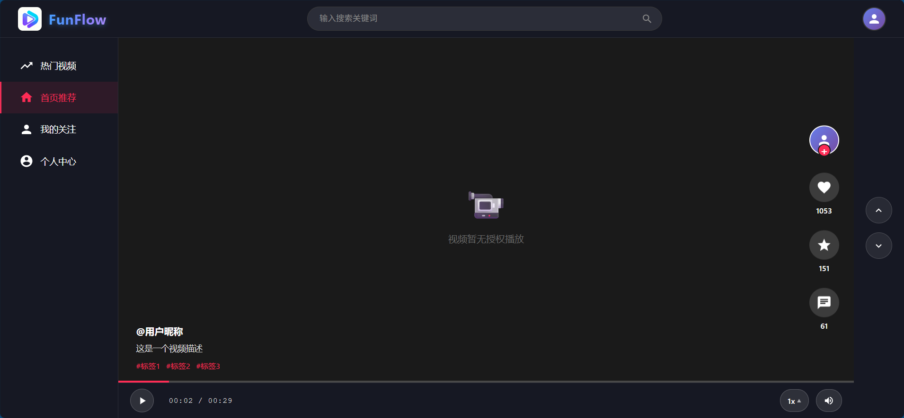
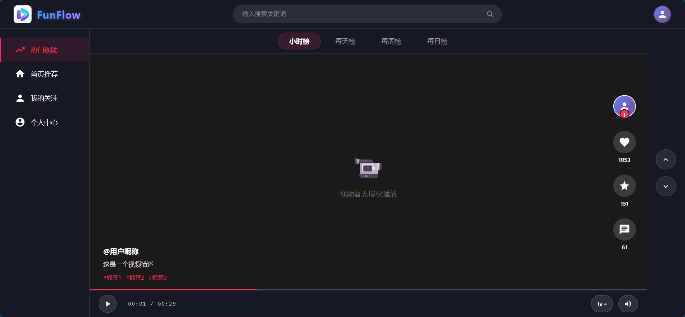
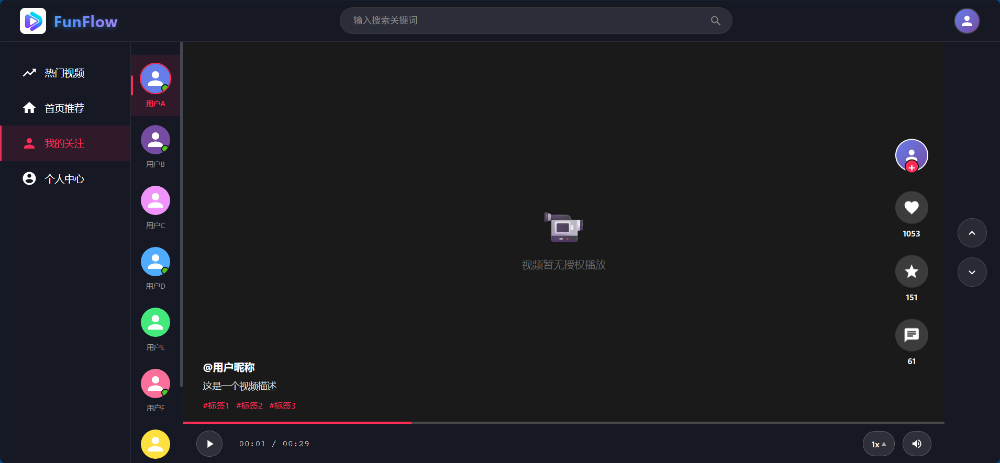
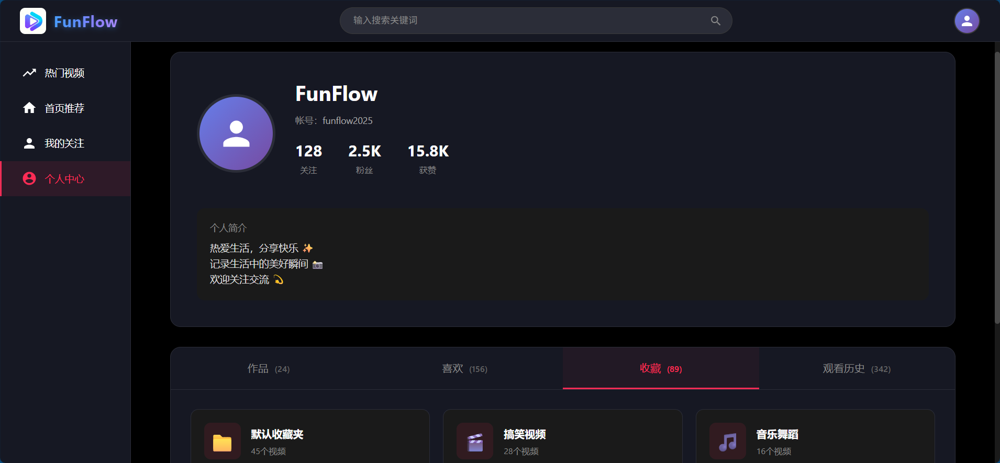

## 产品定位

短视频浏览与分享应用。根据用户行为及热门视频进行兴趣推送，用户可以对别人的视频进行点赞、收藏和评论，也可以分享自己的视频。

主要模块：
- 视频推送模块：首页兴趣流推送、热门视频排行榜、相关视频推荐、标签视频列表、关注视频推送
- 用户管理模块：个人信息，关注、粉丝，作品、收藏、喜欢，视频浏览记录
- 视频功能模块：上传，点赞、收藏、评论
- 第三方服务：内容审核（图片、文字、视频），对象存储（图片、视频）

关键技术：
- 兴趣推送
- 视频播放
- 视频分析
- 相似推荐
- 用户互动

## 模块划分

### 视频推送
- **兴趣流推送**：首页短视频，主要基于用户行为（如点赞、收藏、关注、历史浏览记录、搜索记录等多方面）推送近期热门的且用户感兴趣的视频。
- **热门视频排行榜**：用户可以查看指定时间周期内，排名前 K (如最多 100 个) 的视频榜单。支持时间周期固定，如最近 1 小时、最近 1 天、最近 1 周、最近 1 个月。
- **相关/相似视频推送**：用户可以通过关键字搜索相关视频。同时每个视频有相关推荐功能，推送相似视频。
- **标签视频列表**：每个视频可以通过 `#` 关联多个标签。用户点击标签可以查看携带该标签的所有视频。
- **关注视频推送**：及时向用户推送关注的人发布的视频。

### 用户管理
- **个人信息**：登录、注册，修改密码，修改账号（数字+字母，唯一）、昵称、个人简介、头像
- **互动相关**：关注、粉丝、发布视频总点赞量
- **视频列表**：个人视频、点赞视频、收藏视频（按收藏夹）
- **浏览历史**：视频、用户

### 视频管理
- **发布视频**：视频、封面、标题、文案、标签、是否公开
- **浏览视频**：点赞、收藏、评论、不感兴趣

### 基础服务
- **内容审核**：文本（昵称、简介、标题、文案、评论）、图片（头像、封面、评论）、视频
- **对象存储**：图片、视频

## 关键技术

### 视频播放
前端负责视频播放相关功能，自适应用户界面与视频方向，全屏（显示区域）滚动播放。

后端负责视频预加载相关工作，提升视频播放的流畅度，优化用户体验。

### 视频分析
当用户上传了一个视频后，后端需要及时对该视频进行分析处理。如相关联的标签有哪些、所属分类（新闻、游戏、动漫、生活等）等。为后续兴趣推送及相似视频推荐提供基础服务。

### 兴趣推送
需要综合考虑多种维度实现兴趣推送的目的：
- 基于点赞、收藏、评论、关注，权重级别 1
- 基于浏览历史，权重级别 1
- 基于热点视频，权重级别 2
- 基于搜索，根据搜索次数增加权重
- 基于不感兴趣，逐步减少权重

### 相似推荐

根据关键字、标签、视频信息进行相似推荐
- 匹配：相似度匹配算法

### 用户互动
- 用户：关注、粉丝
- 视频：点赞、收藏、评论
- 私信：简单聊天室 （暂时不考虑该功能）

## 产品原型

### 首页

### 热门排行

### 我的关注

### 个人主页

