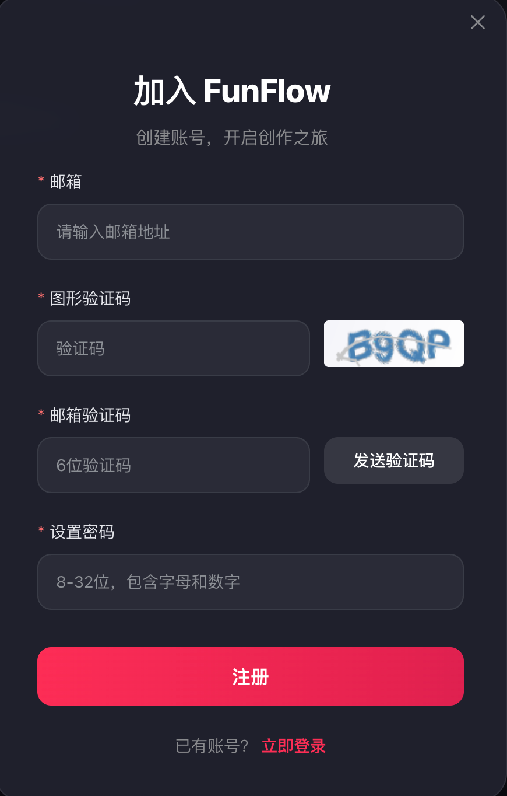
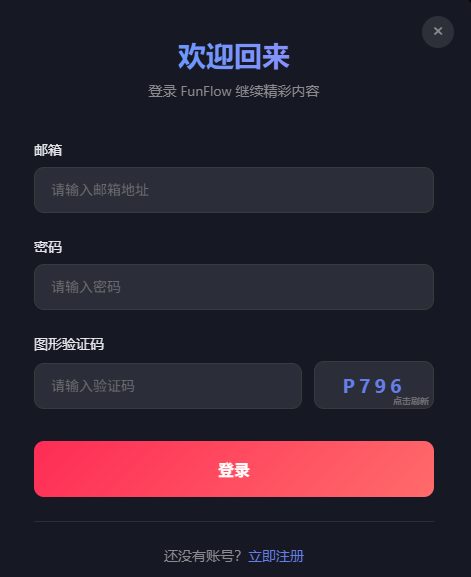

# 注册功能

## 需求分析
- 用户提供邮箱信息进行注册
- 邮件发送具有成本，需要防止恶意注册

实现方案：图形验证码 + 邮箱验证码

## 基本流程
1. 获取图形验证码 `GET /api/auth/captcha`
2. 发送邮箱验证码 `POST /api/auth/send-email-code`
3. 提交注册 `POST /api/auth/register`

## 具体流程

### 第一步：获取并显示图形验证码
**目的**：防止恶意程序滥用邮箱发送服务。

**接口：**`GET /api/auth/captcha`

**前端：**
1. 页面加载/点击刷新：调用 `GET /api/auth/captcha` 接口。
2. 接收数据：从响应中获取 `captchaId` 和 `imageData`。
3. 显示与存储：将图片显示在页面上，并将 `captchaId` 保存在内存或状态管理器中。

**后端：**
1. 接收请求：处理 `GET /api/auth/captcha` 请求。
2. 生成验证码：使用库生成随机文本和对应图片。
3. 存储关系：生成唯一 `captchaId`，将 (`captchaId`, 验证码文本) 存入Redis，设置5分钟过期。
4. 返回数据：返回 `{ captchaId, imageData }`。

**接口响应：**
```json
{
  "code": 200,
  "msg": "success",
  "data": {
    "captchaId": "a1b2c3d4-e5f6-7890-g1h2-i3j4k5l6m7n8",
    "imageData": "data:image/svg+xml;base64,PHN2ZyB4bWxucz0iaHR0cDovL..."
  }
}
```

### 第二步：发送邮箱验证码
**目标**：验证图形验证码并通过邮件发送一次性验证码。

**接口：**`POST /api/auth/send-email-code`

**前端：**
1. 组装数据：用户点击“发送验证码”后，组装数据，包括：`email`、`captchaId`（第一步存的）、`captchaText`（用户输入的）。
2. 调用接口：请求 `POST /api/auth/send-email-code`。
3. UI交互：按钮置灰，开始60秒倒计时。

**请求体：**
```json
{
  "email": "user@example.com",
  "captchaId": "a1b2c3d4-e5f6-7890-g1h2-i3j4k5l6m7n8",
  "captchaText": "A3b7"
}
```

**后端：**
1. 接收请求：处理 `POST /api/auth/send-email-code`，接收请求体。
2. 校验图形验证码：
    - 用 `captchaId` 从 Redis 取出正确的验证码文本。
    - 与用户输入的 `captchaText` 比较（忽略大小写）。
    - 无论对错，立即删除 Redis 中的该 `captchaId`（一次性使用）。
    - 失败则返回错误。
3. 校验邮箱：检查邮箱格式，并查询数据库是否已被注册。
5. 生成并发送邮件验证码：
    - 生成 6 位数字验证码。
    - 将 `("email_code:" + email, 验证码)` 存入Redis，设置 5 分钟过期。
    - 调用邮件服务发送验证码。


### 第三步：验证邮箱并完成注册
**接口：**`POST /api/auth/register`

**前端：**
1. 组装数据：用户输入邮箱验证码、密码等信息后，组装数据。
2. 调用接口：请求 `POST /api/auth/register`。
3. 处理结果：注册成功则跳转到登录页或成功页面；失败则显示错误信息。

**请求体：**
```json
{
  "email": "user@example.com",
  "emailCode": "654321",
  "password": "UserSetPlainTextPassword123!"
}
```

**后端：**
1. 接收请求：处理 `POST /api/auth/registe`，接收请求体。
2. 校验邮箱验证码：
    - 用 `email` 从 Redis 取出正确的邮件验证码。
    - 与用户输入的 `emailCode` 比较。
    - 校验成功，立即删除 Redis 中的该验证码（一次性使用）。
3. 最终业务校验：再次检查邮箱是否已被注册（防止数据竞争）。
4. 创建用户：
    - 使用算法对 `password` 进行哈希加密。
    - 将用户信息（邮箱、哈希后的密码）写入数据库。
5. 返回结果：返回注册成功信息。

## 原型图


# 登录功能

## 需求分析
- 图形验证码防止机器人
- JWT 令牌保存用户信息

## 基本流程
- 获取图形验证码 (`GET /api/auth/captcha`) 
- 登录并获取 JWT (`POST /api/auth/login`)

## 具体流程
### 第一步：获取并显示图形验证码
**接口：**`GET /api/auth/captcha`

**前端：**
1. 登录页加载时：自动调用 `GET /api/captcha` 接口。
2. 接收与显示：接收 `captchaId` 和 `imageData`，显示图片，并保存 `captchaId`。
3. 刷新功能：提供“看不清，换一张”按钮，重新调用该接口。

**后端：**
1. 接收请求：处理 `GET /api/auth/captcha` 请求。
2. 生成验证码：使用库生成随机文本和对应图片。
3. 存储关系：生成唯一 `captchaId`，将 (`captchaId`, 验证码文本) 存入Redis，设置5分钟过期。
4. 返回数据：返回 `{ captchaId, imageData }`。

**接口响应：**
```json
{
  "code": 200,
  "msg": "success",
  "data": {
    "captchaId": "a1b2c3d4-e5f6-7890-g1h2-i3j4k5l6m7n8",
    "imageData": "data:image/svg+xml;base64,PHN2ZyB4bWxucz0iaHR0cDovL..."
  }
}
```

### 第二步：提交登录信息并获取JWT
**接口：**`POST /api/auth/login`

**前端：**
1. 组装数据：用户输入邮箱、密码、图形验证码后，点击登录。
2. 调用接口：请求 `POST /api/auth/login`。
3. 处理令牌：登录成功，从响应中获取 `accessToken`，存入内存或 `localStorage`。
4. 跳转：携带 `accessToken`，跳转到系统首页。

**请求体：**
```json
{
  "email": "user@example.com",
  "password": "UserSetPlainTextPassword123!",
  "captchaId": "login_captcha_123456",
  "captchaText": "X8y9"
}
```

**后端：**
1. 接收请求：处理 `POST /api/auth/login`。
2. 校验图形验证码：
  - 使用 `captchaId` 从 Redis 取出正确验证码。
  - 与用户输入的 `captchaText` 比较。
  - 立即删除 Redis 中的该 `captchaId`。
3. 验证用户凭证：
  - 根据 `email` 从数据库查询用户记录。
  - 如果用户不存在，返回模糊错误：“用户名或密码错误”。
  - 使用相同的加密算法比对用户输入的密码和数据库存储的哈希密码。
  - 如果密码不匹配，返回模糊错误：“用户名或密码错误”。
4. 生成JWT令牌：包含用户ID、角色等信息。
5. 返回令牌：将 Token 返回给前端。

**响应体：**
```json
{
  "code": 200,
  "msg": "登录成功",
  "data": {
    "accessToken": "eyJhbGciOiJIUzI1NiIsInR5cCI6IkpXVCJ9..."
  }
}
```

## 原型图


## 待完善
- 添加 refreshToken 功能
- 图形验证码接口添加请求频率限制
